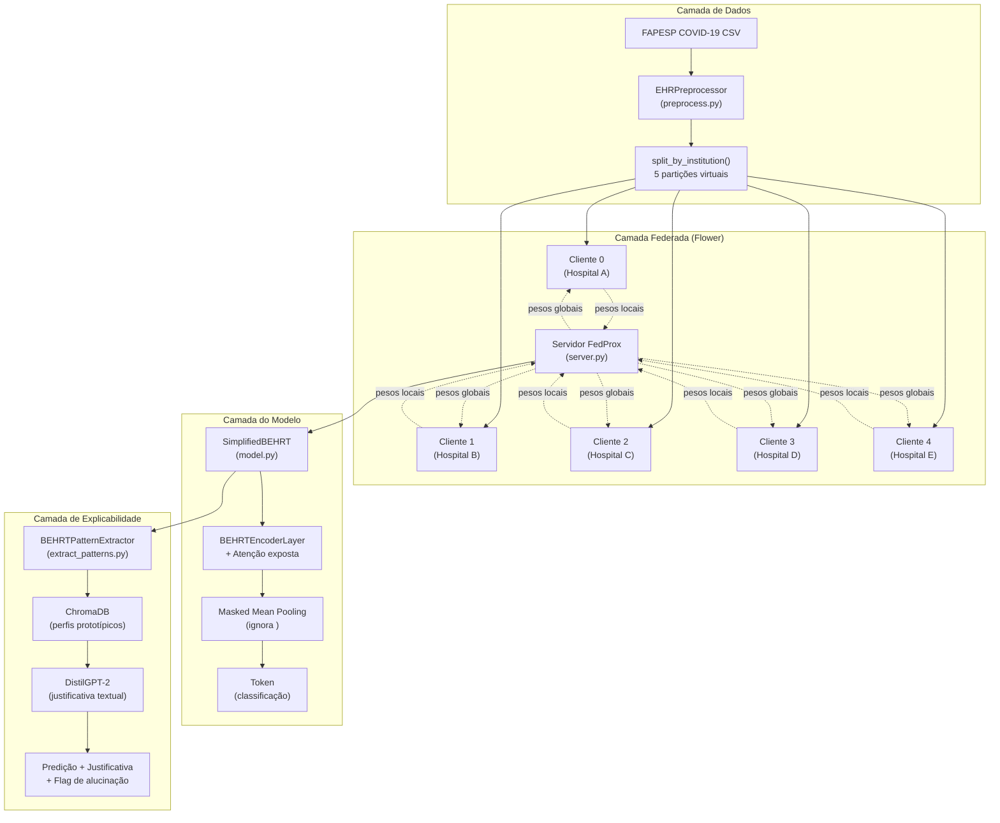
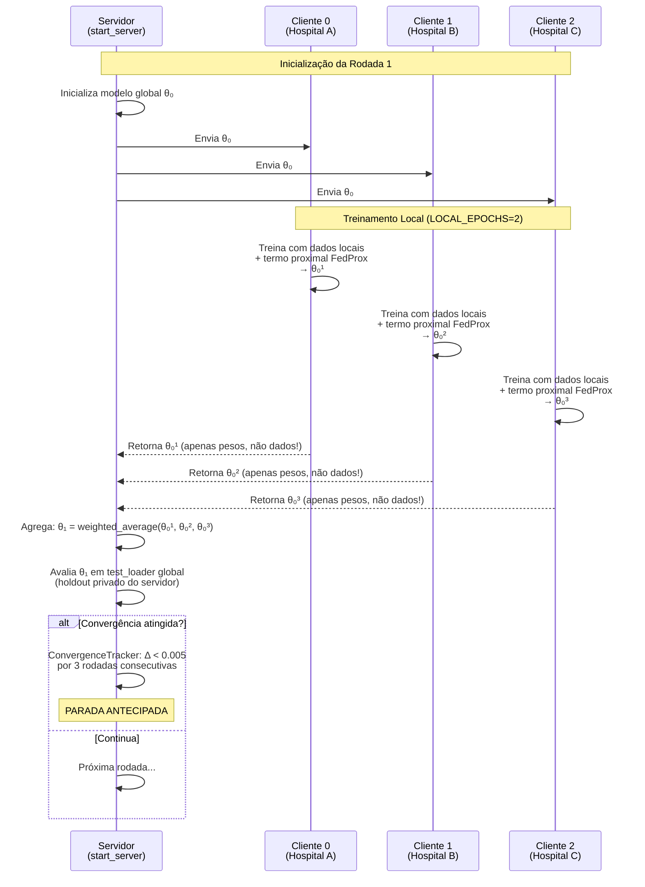
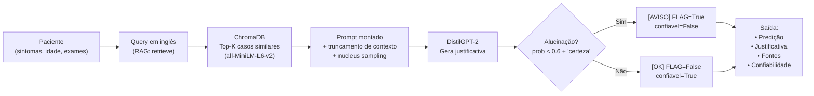
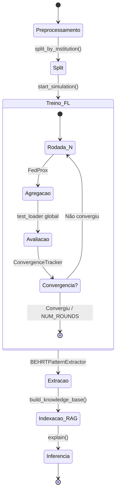

# MOSAIC-FL

**Módulo de Predição Federada para Possibilidades de Diagnóstico e Evoluções Clínicas**

Extensão preditiva do ClinicalPath (Linhares et al., 2023) combinando:
- **Aprendizado Federado (FedProx)** para dados hospitalares fragmentados
- **BEHRT simplificado** para sequências clínicas temporais
- **RAG (ChromaDB + DistilGPT-2)** para justificativa diagnóstica interpretável

> **Nota sobre escopo deste repositório:** Esta implementação é uma **simulação local** do Aprendizado Federado (FL), projetada para validação do algoritmo em ambiente acadêmico (TCC). Todos os "clientes" (hospitais virtuais) executam na mesma máquina via Flower local. Em implantação real, cada `FedProxClient` rodaria em um hospital distinto, com comunicação criptografada via TLS, garantindo que os prontuários eletrônicos **nunca saiam da instituição**.

---

##  Arquitetura do Sistema

### Simulação Local (este repositório)

```
┌─────────────────────────────────────────┐
│         MÁQUINA LOCAL (Dell i7)         │
│                                         │
│  ┌─────────────┐    ┌─────────────────┐  │
│  │  Servidor   │◄──►│  Hospital A     │  │
│  │  (server.py)│    │  (client.py #0) │  │
│  │             │◄──►│  Hospital B     │  │
│  │  - Agrega   │    │  (client.py #1) │  │
│  │    pesos    │◄──►│  Hospital C     │  │
│  │  - Avalia   │    │  (client.py #2) │  │
│  │    global   │◄──►│  Hospital D     │  │
│  │  - RAG      │    │  (client.py #3) │  │
│  │             │◄──►│  Hospital E     │  │
│  └─────────────┘    │  (client.py #4) │  │
│                     └─────────────────┘  │
│                                         │
│  Dados: split_by_institution() divide   │
│  o dataset FAPESP em 5 partições locais │
└─────────────────────────────────────────┘
```

### Arquitetura de Produção (visão futura)

```
┌─────────────────┐          TLS         ┌─────────────────┐
│   SERVIDOR      │◄──────────────────────►│   HOSPITAL A    │
│  (nuvem/USP)    │    pesos criptografados │  (client.py)    │
│                 │                        │                 │
│  • Coordena   │◄──────────────────────►│  • Dados locais │
│    rodadas FL  │                        │  • Treina local │
│  • Agrega     │◄──────────────────────►│  • Devolve     │
│    pesos       │    pesos criptografados │    apenas pesos │
│  • RAG global │                        │                 │
│  • BEHRT      │◄──────────────────────►│   HOSPITAL B    │
│    avaliação   │                        │   HOSPITAL C    │
│                 │                        │   ...           │
└─────────────────┘                        └─────────────────┘

[AVISO] PRONTUÁRIOS NUNCA SAEM DOS HOSPITAIS — apenas os pesos do modelo.
```

### Como funciona o Federated Learning

1. **Servidor inicia** o processo — envia o modelo global (pesos iniciais) para cada hospital
2. **Cada hospital treina localmente** com seus próprios prontuários (dados nunca saem)
3. **Hospital devolve apenas os pesos atualizados** — não os dados!
4. **Servidor agrega** os pesos (média ponderada pelo FedProx) e envia o novo modelo global
5. **Repete por N rodadas** até convergência

---

##  Estrutura do Projeto

```
mosaic-fl/
├── run.py                          # Ponto de entrada principal (orquestra simulação)
├── pyproject.toml                  # Metadados e dependências do pacote
├── requirements.txt                # Dependências (referência)
├── setup.sh                        # Script de instalação Linux/macOS
├── setup.bat                       # Script de instalação Windows
├── makefile                        # Atalhos de desenvolvimento
└── src/
    ├── config.py                   # Hiperparâmetros globais e calibração de hardware
    ├── preprocess.py               # Padronização FAPESP COVID-19 (Experimento 1)
    │                               # • Interoperabilidade HF1-HF5
    │                               # • Normalização de unidades (lb→kg, meses→anos)
    │                               # • Vocabulário dinâmico com <PAD>, <UNK>, <MASK>, <CLS>
    ├── model.py                    # BEHRT simplificado
    │                               # • Embedding + Positional Encoding
    │                               # • Transformer Encoder customizado (exposição de atenção)
    │                               # • Masked Mean Pooling (ignora padding)
    │                               # • Classificador multiclasse
    ├── client.py                   # Cliente Flower com FedProx
    │                               # • Treino local por hospital virtual
    │                               # • Termo proximal ||w_local - w_global||²
    │                               # • Apenas pesos treináveis trafegam (não buffers)
    ├── server.py                   # Servidor de agregação e avaliação global
    │                               # • Estratégia FedProx customizada
    │                               # • ConvergenceTracker (parada antecipada)
    │                               # • Avaliação em holdout global (privado do servidor)
    ├── rag_system.py               # Justificativa clínica via RAG (ChromaDB)
    │                               # • Recuperação de casos similares (all-MiniLM-L6-v2)
    │                               # • Geração de texto (DistilGPT-2) em inglês
    │                               # • Detecção de alucinação simples
    │                               # • Anonimização estrutural (idade → faixa etária)
    ├── extract_patterns.py         # Extração de padrões do BEHRT para o RAG
    │                               # • Análise de atenção por camada e cabeça
    │                               # • Perfis prototípicos por desfecho clínico
    └── experiments/
        ├── runner.py               # Orquestrador dos 5 experimentos do TCC
        └── run_experiments.py      # Legado — redireciona para runner.py
```

---

##  Diagramas de Arquitetura (Mermaid)

### Arquitetura Geral do Sistema



### Fluxo de Dados no Aprendizado Federado



### Pipeline de Inferência com RAG



### Ciclo de Vida Completo do Experimento



##  Configuração e Hardware

Este projeto foi calibrado para rodar de forma estável em um **Dell Inspiron 5402**:
- CPU: Intel i7-1165G7 (4 núcleos / 8 threads)
- RAM: 16 GB
- GPU: Intel Iris Xe (sem CUDA)

**Tempo estimado de execução completa (5 experimentos):** 15–25 minutos

Principais ajustes de hardware:

| Parâmetro | Valor | Justificativa |
|---|---|---|
| `OMP/MKL_NUM_THREADS` | 4 | Libera 4 threads para o SO, evita travamento |
| `TOKENIZERS_PARALLELISM` | `false` | Elimina conflito de threads do HuggingFace |
| `DEVICE` | `cpu` | Intel Iris Xe não tem suporte CUDA |
| `BATCH_SIZE` | 16 | Reduz uso de RAM por cliente (~2 GB/cliente) |
| `LOCAL_EPOCHS` | 2 | Menos iterações por rodada federada |
| `NUM_ROUNDS` | 20 | Suficiente para demonstrar convergência |
| `MAX_NEW_TOKENS` | 64 | Geração de texto mais rápida no RAG |

Para máquinas com GPU dedicada, reverta `DEVICE` para `cuda` e aumente `BATCH_SIZE`, `NUM_ROUNDS` e `NUM_CLIENTS` conforme necessário.

---

##  Instalação

### Linux / macOS

```bash
# 1. Clone o repositório
git clone https://github.com/JacAbreu/mosaic-fl.git
cd mosaic-fl

# 2. Execute o script de setup
#    Ele cria o ambiente virtual .venv e instala todas as dependências
chmod +x setup.sh
bash ./setup.sh
```

### Windows

```bat
:: 1. Clone o repositório
git clone https://github.com/JacAbreu/mosaic-fl.git
cd mosaic-fl

:: 2. Execute o script de setup
setup.bat
```

O setup cria um ambiente virtual `.venv` na raiz do projeto e instala o pacote `mosaicfl` em modo editável (`pip install -e .`), tornando todos os módulos acessíveis sem configuração adicional de `PYTHONPATH`.

---

##  Execução

### Linux / macOS

```bash
# Ative o ambiente virtual (necessário uma vez por sessão de terminal)
source .venv/bin/activate

# Execute os 5 experimentos
python run.py
```

### Windows

```bat
:: Ative o ambiente virtual
.venv\Scripts\activate

:: Execute os 5 experimentos
python run.py
```

### Via Makefile (Linux / macOS)

```bash
make setup   # cria o ambiente e instala as dependências
make run     # executa os experimentos
make clean   # remove o ambiente virtual e caches
```

---

##  Privacidade e Segurança

### O que protege este código (simulação)
- **Dados nunca são centralizados:** `split_by_institution()` mantém partições isoladas em memória
- **Apenas pesos trafegam:** `get_parameters()` retorna apenas tensores treináveis (não dados brutos)
- **Anonimização no RAG:** idades exatas são substituídas por faixas etárias antes de indexar no ChromaDB

### O que seria necessário para produção
- **TLS/SSL** na comunicação Flower (certificados X.509 entre servidor e clientes)
- **Differential Privacy** nos pesos enviados (adicionar ruído de Laplace/Gaussiano)
- **Secure Aggregation** (criptografia homomórfica ou secret sharing para agregar pesos sem o servidor ver valores individuais)
- **Auditoria LGPD/HIPAA:** logs de acesso, consentimento dos pacientes, DPO designado
- **Deployment real:** cada `client.py` rodaria em um container Docker no hospital, com acesso apenas ao banco local (PostgreSQL/Oracle Health)

---

##  Experimentos

O `runner.py` orquestra 5 experimentos previstos para o TCC:

| Experimento | Objetivo | Saída |
|---|---|---|
| 1 | Interoperabilidade (HF1-HF5) | `preprocess.py` padroniza unidades e vocabulário entre instituições |
| 2 | Convergência FedProx | Curva de acurácia global por rodada, comparação com FedAvg |
| 3 | Explicabilidade BEHRT | Mapas de atenção por camada/cabeça (`extract_patterns.py`) |
| 4 | Justificativa RAG | Texto gerado + casos recuperados + flag de alucinação |
| 5 | Eficiência comunicacional | MB trafegados por rodada, tempo total de treinamento |

---

---

##  O que este código faz (Experimento / TCC)

Este repositório implementa uma **simulação controlada** do Aprendizado Federado (FL) para validação do algoritmo em ambiente acadêmico. Abaixo, o que cada componente faz **neste contexto de experimento**:

### Simulação Local (tudo na mesma máquina)

| Componente | O que faz no TCC | O que NÃO faz |
|---|---|---|
| `preprocess.py` | Lê CSV local, padroniza unidades, constrói vocabulário, codifica sequências | Não se conecta a bancos de dados reais (PostgreSQL, Oracle, HL7 FHIR) |
| `model.py` | BEHRT simplificado com ~64 dimensões, 2 camadas, 4 heads — roda em CPU | Não é um modelo clinicamente validado; não tem certificação ANVISA/FDA |
| `client.py` | Simula 5 hospitais virtuais usando `TensorDataset` em memória | Não recebe conexões de rede reais; não isola dados em máquinas físicas distintas |
| `server.py` | Orquestra rodadas via Flower local (`start_server` em loop) | Não escuta em IP público; não usa TLS; não autentica clientes |
| `rag_system.py` | Gera texto explicativo com DistilGPT-2 (modelo geral, não médico) | Não garante factualidade clínica; não cita fontes com DOI/PMID |
| `extract_patterns.py` | Analisa mapas de atenção para gerar perfis prototípicos | Não valida estatisticamente a significância clínica dos padrões |

### Fluxo de um experimento típico

```
1. run.py → carrega CSV local (data/fapesp_covid19.csv)
2.   → EHRPreprocessor.process() → DataFrame pandas limpo
3.   → split_by_institution() → 5 DataFrames ("hospitais virtuais")
4.   → Para cada experimento:
5.      → Flower inicia servidor + 5 clientes na MESMA máquina
6.      → Cada "cliente" treina por 2 epochs com SEU DataFrame
7.      → Pesos agregados via FedProx (média ponderada)
8.      → Servidor avalia em holdout global (20% do dataset)
9.      → ConvergenceTracker verifica estabilidade da acurácia
10.  → Após convergência:
11.     → BEHRTPatternExtractor analisa atenção do modelo global
12.     → ClinicalRAG indexa padrões no ChromaDB (local)
13.     → Gera justificativa para caso de teste aleatório
14.  → Resultados salvos em JSON/stdout para análise da banca
```

### Limitações explícitas do experimento

- **Dataset:** FAPESP COVID-19 (público, anonimizado) — não contém dados reais de prontuário eletrônico com identificadores de paciente.
- **Escala:** ~10k tokens de vocabulário, sequências de 128 posições — suficiente para demonstrar conceito, mas menor que modelos clínicos de produção (ex: Med-BERT com 30k+ tokens, 512 posições).
- **Hardware:** CPU Intel i7-1165G7 — treinamento lento (~15-25 min para 5 experimentos), inviável para datasets de milhões de registros.
- **Validação:** Holdout simples (80/20) sem validação cruzada estratificada por instituição.
- **Métricas:** Acurácia e loss — não inclui AUC-ROC, sensibilidade, especificidade, calibration (necessárias para decisão clínica).
- **RAG:** DistilGPT-2 (modelo geral de internet) — pode gerar linguagem não-clínica ou imprecisa; não substitui parecer médico.

---

##  O que falta para o mundo real (Roadmap de Produção)

Para transformar esta prova de conceito em um **sistema de apoio à decisão clínica (CDSS) implantado em hospitais**, os seguintes itens são necessários:

### 1. Infraestrutura de Dados

| Tarefa | Descrição | Complexidade |
|---|---|---|
| **Integração HL7 FHIR** | Conectar a prontuários eletrônicos (EPR/EMR) dos hospitais via padrão FHIR R4 | [ALTA] Alta |
| **ETL em tempo real** | Pipeline de extração, transformação e carga dos dados clínicos (Airflow, Spark) | [ALTA] Alta |
| **Data Quality** | Validação de schema, detecção de outliers, consistência temporal (Great Expectations) | [MEDIA] Média |
| **Vocabulário clínico padronizado** | Mapear termos locais para SNOMED CT, ICD-10, LOINC — não apenas tokens genéricos | [ALTA] Alta |

### 2. Aprendizado Federado em Produção

| Tarefa | Descrição | Complexidade |
|---|---|---|
| **TLS mútuo** | Certificados X.509 entre servidor e cada hospital; autenticação de clientes | [MEDIA] Média |
| **Differential Privacy** | Adicionar ruído (Laplace/Gaussiano) nos pesos antes de enviar ao servidor (ε-differential privacy) | [ALTA] Alta |
| **Secure Aggregation** | Agregar pesos via criptografia homomórfica ou secret sharing (ex: PySyft, SEAL) | [ALTA] Alta |
| **Tolerância a falhas** | Clientes offline (hospitais sem internet), reconexão automática, checkpoint de rodadas | [MEDIA] Média |
| **Escalabilidade** | Suportar 50+ hospitais com Flower SuperLink/SuperNode em cluster Kubernetes | [ALTA] Alta |

### 3. Modelo e Validação Clínica

| Tarefa | Descrição | Complexidade |
|---|---|---|
| **Modelo maior e fine-tuned** | BEHRT/Med-BERT com 512 posições, fine-tuning em dados clínicos brasileiros | [ALTA] Alta |
| **Validação externa** | Testar em hospitais que NÃO participaram do treinamento (generalização) | [ALTA] Alta |
| **Métricas clínicas** | AUC-ROC, sensibilidade, especificidade, PPV, NPV, calibration curve, Brier score | [MEDIA] Média |
| **Estudo retrospectivo** | Análise de eficácia em coorte histórica (ex: predição de evolução COVID-19 em 2020) | [ALTA] Alta |
| **Estudo prospectivo** | Validação em tempo real com acompanhamento de pacientes atuais | [ALTA] Alta |
| **Regulatório** | Submissão à ANVISA (Brasil) ou FDA (EUA) como Software Médico (SaMD) Classe II/III | [ALTA] Alta |

### 4. RAG e Explicabilidade

| Tarefa | Descrição | Complexidade |
|---|---|---|
| **Modelo médico especializado** | Substituir DistilGPT-2 por BioGPT, GatorTron, ou modelo fine-tuned em português médico | [MEDIA] Média |
| **Base de evidências** | Indexar artigos do PubMed, diretrizes SBPT/SBC, protocols SUS no ChromaDB | [MEDIA] Média |
| **Citação estruturada** | RAG deve citar fontes com PMID, DOI, ou protocolo SUS — não apenas "casos similares" | [MEDIA] Média |
| **Nível de evidência** | Classificar justificativa por GRADE (A: RCT, B: coorte, C: opinião de especialista) | [ALTA] Alta |
| **Detecção de alucinação avançada** | Usar modelo de verificação de fatos (ex: FActScore, SelfCheckGPT) em vez de heurística simples | [ALTA] Alta |

### 5. Privacidade, LGPD e Governança

| Tarefa | Descrição | Complexidade |
|---|---|---|
| **Consentimento informado** | Pacientes devem consentir uso de dados para pesquisa/IA (LGPD art. 7º, inc. I) | [MEDIA] Média |
| **DPO designado** | Data Protection Officer em cada hospital participante | [MEDIA] Média |
| **Termo de responsabilidade** | Contrato entre hospitais e operador do servidor definindo fluxo de dados, retenção, exclusão | [MEDIA] Média |
| **Auditoria** | Logs imutáveis de acesso (quem viu o quê, quando), com hash criptográfico | [MEDIA] Média |
| **Anonimização diferenciada** | k-anonimato, l-diversity, t-closenase nos dados antes de indexar no RAG | [ALTA] Alta |
| **Direito ao esquecimento** | Mecanismo para remover contribuição de um paciente do modelo global (machine unlearning) | [ALTA] Alta |

### 6. Interface e Integração Clínica

| Tarefa | Descrição | Complexidade |
|---|---|---|
| **API REST/GraphQL** | Endpoint para o sistema de prontuário eletrônico consultar predições em tempo real | [MEDIA] Média |
| **Interface médica** | Dashboard com alertas de risco (ex: "Probabilidade de pneumonia: 78% — justificativa:"), integrado ao fluxo de trabalho do médico | [MEDIA] Média |
| **Alerta de baixa confiança** | Quando probabilidade < 60% ou alucinação detectada, exibir "Predição incerta — avaliação humana necessária" | [BAIXA] Baixa |
| **Feedback do médico** | Médico pode marcar predição como correta/incorreta — dados de feedback alimentam re-treinamento | [MEDIA] Média |
| **Mobile/Tablet** | Acesso em leitos via app leve (React Native/Flutter) para médicos em rounds | [MEDIA] Média |

---

##  Resumo: Experimento vs. Produção

| Aspecto | Experimento (TCC) | Produção (Mundo Real) |
|---|---|---|
| **Dados** | CSV local, FAPESP COVID-19 (público) | EHR real via HL7 FHIR, dados sensíveis |
| **Clientes** | 5 DataFrames na mesma máquina | 5-50+ hospitais em máquinas distintas |
| **Rede** | Loopback local (127.0.0.1) | Internet com TLS, firewall, VPN |
| **Privacidade** | Partições em memória (simulação) | Differential Privacy + Secure Aggregation |
| **Modelo** | BEHRT mini (64d, 2 camadas, CPU) | Med-BERT/Clinical-BERT (512d, 12+ camadas, GPU) |
| **RAG** | DistilGPT-2 genérico, casos similares | Modelo médico fine-tuned, citações com PMID/DOI |
| **Validação** | Acurácia em holdout 80/20 | AUC-ROC, estudo retrospectivo + prospectivo, ANVISA |
| **Usuário final** | Pesquisador/banca | Médico em leito de UTI com paciente real |
| **Responsabilidade** | Acadêmica | Civil, criminal, ética (CFM, CREMESP) |
| **Tempo de resposta** | 15-25 min (treinamento) | < 2 segundos (predição em tempo real) |

##  Solução de Problemas

**`externally-managed-environment` ao rodar `pip install`**

Não use `pip install -r requirements.txt` diretamente. Use o `setup.sh` (Linux/macOS) ou `setup.bat` (Windows), que criam um ambiente virtual isolado automaticamente.

**`ModuleNotFoundError: No module named 'mosaicfl'`**

O pacote não foi instalado ou o ambiente virtual não está ativo. Verifique:

```bash
# O ambiente está ativo? O prompt deve mostrar (.venv)
source .venv/bin/activate

# O pacote está instalado?
pip show mosaicfl

# Se não estiver, instale:
pip install -e .
```

**`python` não encontrado (Linux)**

Algumas distribuições usam `python3` em vez de `python`. Instale o alias:

```bash
sudo apt install python-is-python3
```

---

##  Referências

- Linhares et al., 2023. *ClinicalPath* (base do projeto)
- McMahan et al., 2017. *Communication-Efficient Learning of Deep Networks from Decentralized Data* (FedAvg)
- Li et al., 2020. *Federated Optimization in Heterogeneous Networks* (FedProx)
- Rasmy et al., 2021. *Med-BERT* / BEHRT para prontuários eletrônicos
- Lewis et al., 2020. *Retrieval-Augmented Generation for Knowledge-Intensive NLP Tasks*

---

##  Licença

MIT License — veja `pyproject.toml` para detalhes.

---

> **Autora:** Jacqueline Abreu do N. T. R. Lopes  
> **Instituição:** ICMC/USP — São Carlos  
> **Contato:** abreujacline@gmail.com
