# MOSAIC-FL — Diagramas de Arquitetura (C4 + UML)

> Este documento complementa `docs/FLUXO_APRENDIZADO_FEDERADO.md` (que descreve o *fluxo de dados* ponta a ponta) com uma visão *arquitetural* do sistema, em dois vocabulários de diagrama diferentes, para leitores com backgrounds distintos:
>
> - **Modelo C4** (Simon Brown) — do nível mais amplo (Contexto) ao mais específico (Código), em 4 níveis. É o vocabulário preferido pela autora.
> - **UML** (sequência e caso de uso) — para leitores da banca ou da literatura que não conhecem C4 e preferem a notação UML clássica.
>
> **Convenção de renderização:** todos os diagramas C4 e de sequência estão em **Mermaid** (mesma ferramenta usada em `FLUXO_APRENDIZADO_FEDERADO.md` — renderiza nativamente no GitHub e na maioria dos visualizadores Markdown). O diagrama de caso de uso é a única exceção: Mermaid **não tem** tipo de diagrama de caso de uso nativo (só flowchart, sequência, classe, estado, ER, C4, mindmap, timeline, gantt, sankey). Para ter a notação UML genuína (atores-boneco + elipses de caso de uso, `<<include>>`/`<<extend>>`), esse diagrama está em **PlantUML**, que exige um renderizador à parte (ver nota na seção 6).

---

## Índice

1. [Os três cenários representados](#1-os-três-cenários-representados)
2. [Nível 1 — Contexto do Sistema (C4)](#2-nível-1--contexto-do-sistema-c4)
3. [Nível 2 — Contêineres (C4)](#3-nível-2--contêineres-c4)
4. [Nível 3 — Componentes (C4), um por cenário](#4-nível-3--componentes-c4-um-por-cenário)
5. [Nível 4 — Código (C4), classes-chave por cenário](#5-nível-4--código-c4-classes-chave-por-cenário)
6. [Diagramas de Sequência (UML)](#6-diagramas-de-sequência-uml)
7. [Diagrama de Caso de Uso (UML)](#7-diagrama-de-caso-de-uso-uml)

---

## 1. Os três cenários representados

O projeto tem três fluxos operacionalmente distintos, que usam containers e componentes parcialmente diferentes. Os níveis 1 e 2 do C4 são únicos (mostram o sistema inteiro); a partir do nível 3, cada cenário ganha seu próprio diagrama:

| Cenário | O que representa | Containers principais envolvidos |
|---|---|---|
| **A — Comunicação Federada** | Troca de pesos entre SuperLink, ServerApp e os SuperNodes dos hospitais, round a round | SuperLink, ServerApp, SuperNode BPSP, SuperNode HSL |
| **B — Treinamento** | Orquestração das 4 fases do pipeline de pesquisa (`make training-full`), agregação FedNova, calibração, checkpoint | Ambiente de Pesquisa (`experiments/`), PostgreSQL |
| **C — Disponibilização via API + RAG** | Requisição de um hospital à API de inferência, predição com MC Dropout, geração da justificativa clínica via RAG | API de Inferência, PostgreSQL, Ollama |

---

## 2. Nível 1 — Contexto do Sistema (C4)

Visão mais ampla: o MOSAIC-FL como caixa única, e quem/o que interage com ele. Um único diagrama cobre os três cenários — os atores aparecem todos juntos porque, do ponto de vista de contexto, todos "conversam com o sistema", independente do cenário interno.

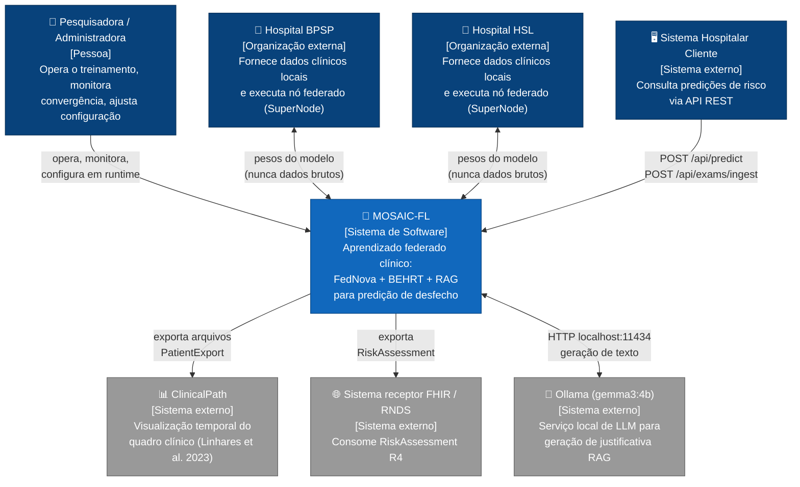

**Nota de privacidade estrutural:** a única seta bidirecional entre hospitais e o sistema carrega **pesos do modelo**, nunca dados clínicos brutos — essa é a garantia central que o resto dos diagramas (a partir do nível 2) precisa preservar visualmente.

---

## 3. Nível 2 — Contêineres (C4)

Cada retângulo abaixo é um processo/serviço deployável de forma independente. Um único diagrama cobre os três cenários; as legendas de aresta indicam a que cenário (A/B/C) cada interação pertence.

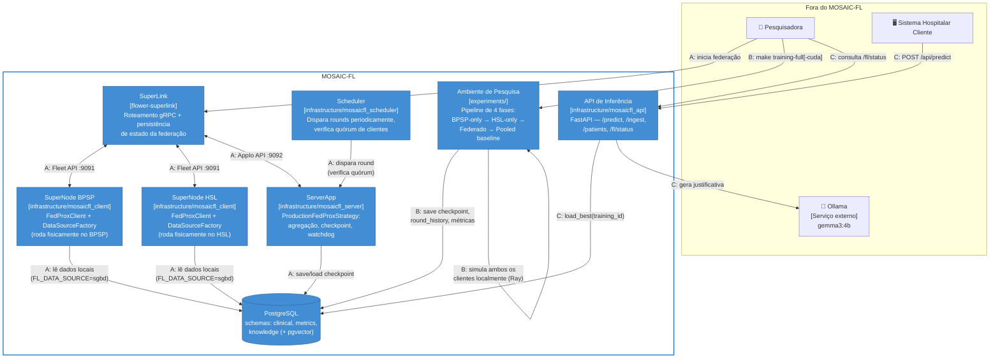

**Nota sobre o Ambiente de Pesquisa:** ao contrário dos demais containers (que são serviços de produção, deployáveis independentemente — inclusive via Docker/Helm, ver README), `experiments/` roda localmente e **simula** os dois clientes num único processo (via Ray), em vez de comunicação real entre máquinas. É o modo usado para gerar os resultados reportados no TCC. O modo "Rede Federada Real" (desktop + notebook, documentado no README) usa os containers de produção (SuperLink/ServerApp/SuperNode) de fato distribuídos.

---

## 4. Nível 3 — Componentes (C4), um por cenário

### 4.A — Comunicação Federada

Zoom nos containers `ServerApp` e `SuperNode`, mostrando os módulos internos responsáveis pela troca de pesos round a round.

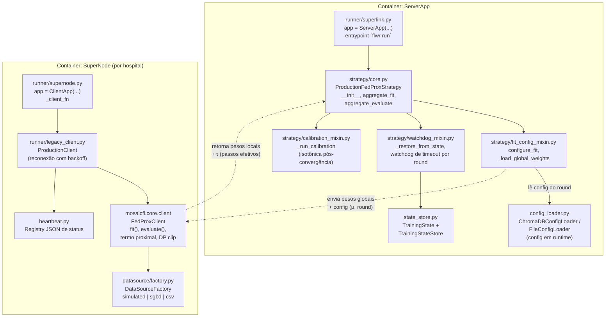

### 4.B — Treinamento (pipeline de pesquisa)

Zoom no container `Ambiente de Pesquisa`, mostrando a orquestração das 4 fases e a mecânica de agregação.

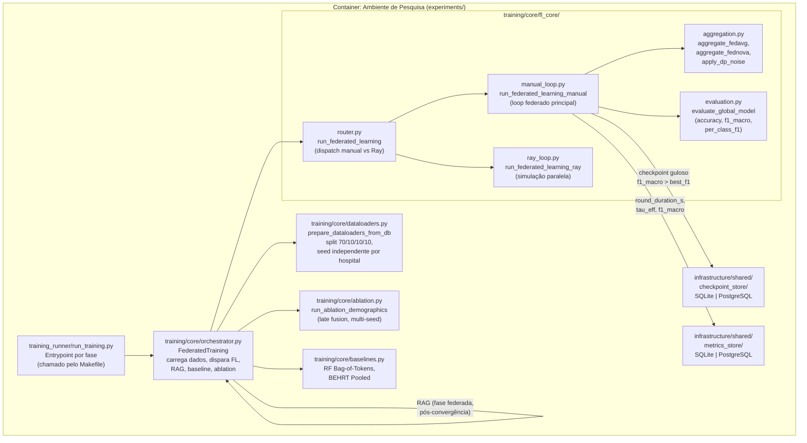

### 4.C — Disponibilização via API + RAG

Zoom no container `API de Inferência`, mostrando o caminho de uma predição até a justificativa clínica.

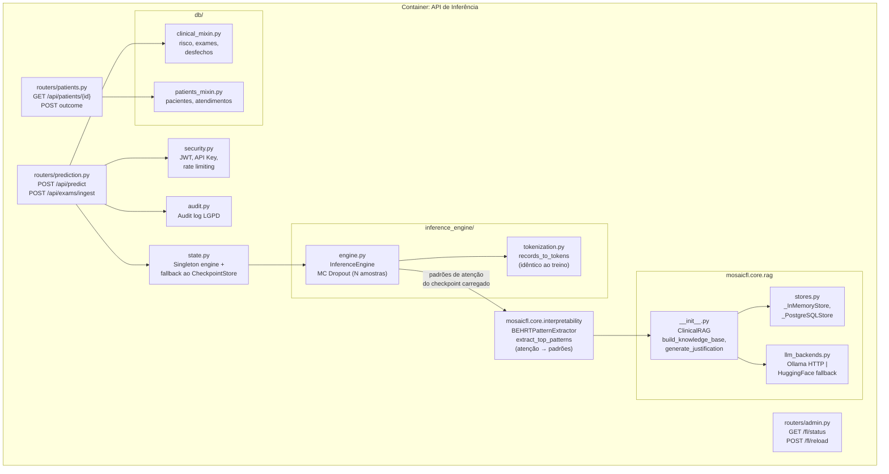

---

## 5. Nível 4 — Código (C4), classes-chave por cenário

O C4 trata o nível 4 como opcional — em geral só vale a pena diagramar as classes com maior densidade de decisão de design. Um diagrama de classes por cenário, com os métodos e atributos que efetivamente aparecem nas discussões deste projeto (não é um diagrama de classes exaustivo).

### 5.A — Comunicação Federada: `ProductionFedProxStrategy` e `FedProxClient`

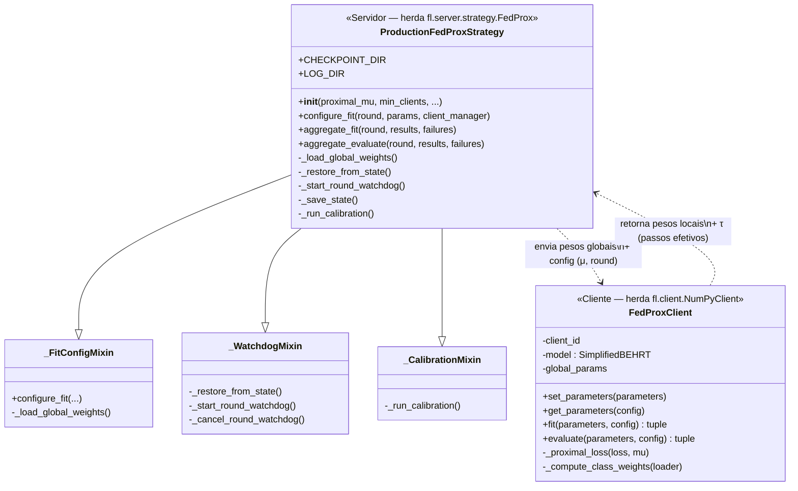

### 5.B — Treinamento: `FederatedTraining` e a agregação

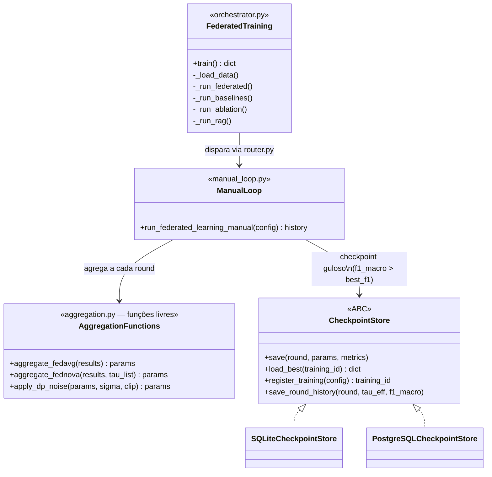

### 5.C — API + RAG: `InferenceEngine` e `ClinicalRAG`

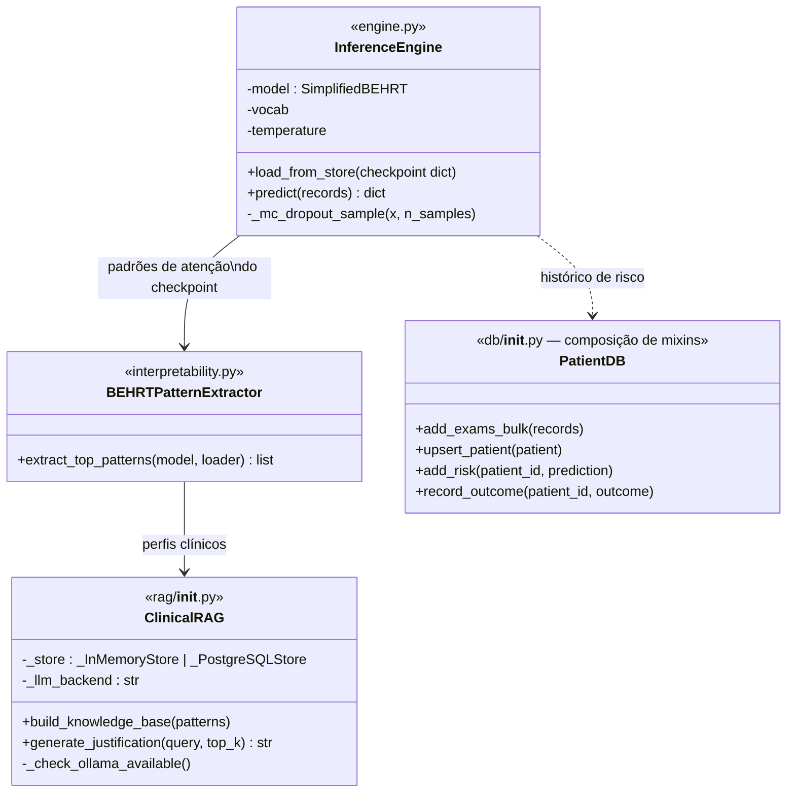

---

## 6. Diagramas de Sequência (UML)

Notação UML de sequência padrão, em Mermaid `sequenceDiagram` — renderiza como diagrama de sequência UML genuíno (atores/objetos com linha de vida, mensagens síncronas/assíncronas, ativação).

### 6.A — Rodada Federada Completa

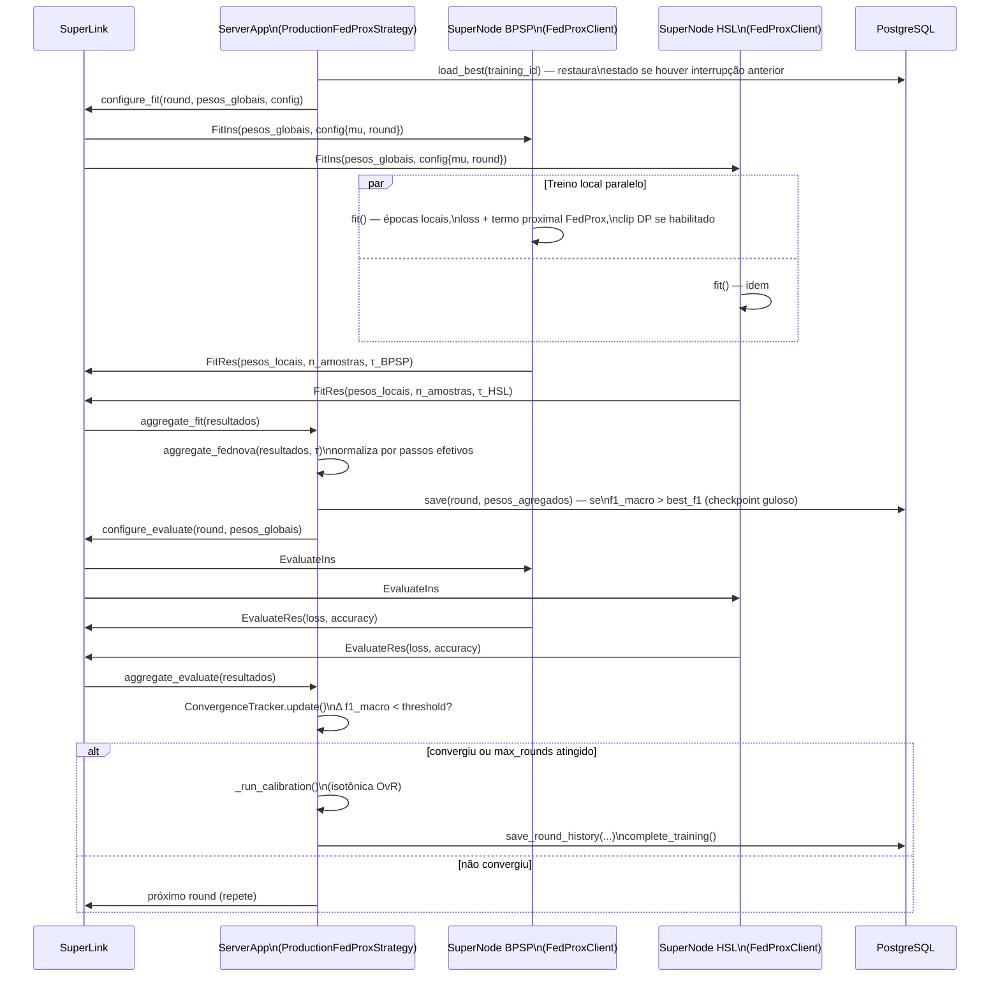

### 6.B — Pipeline de Treinamento (`make training-full`)

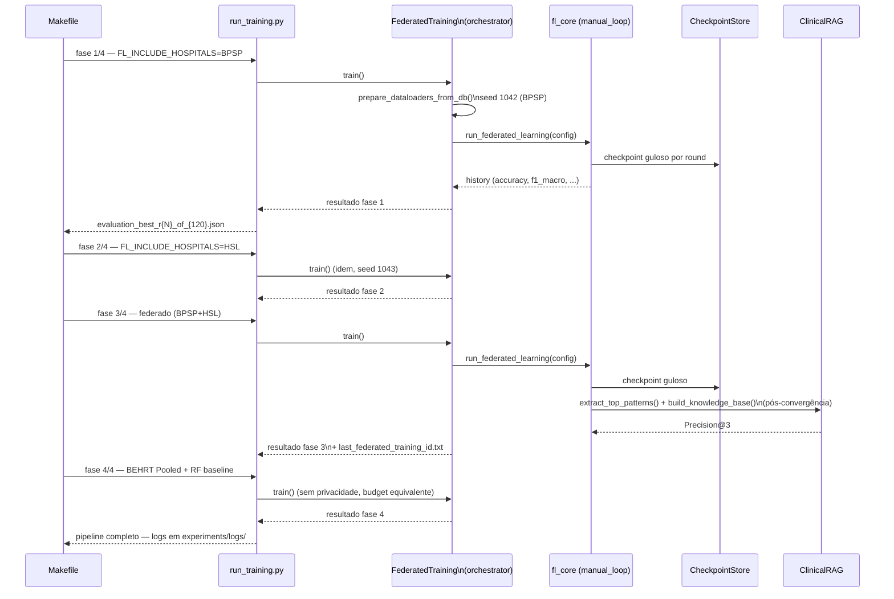

### 6.C — Requisição de Inferência com Justificativa RAG

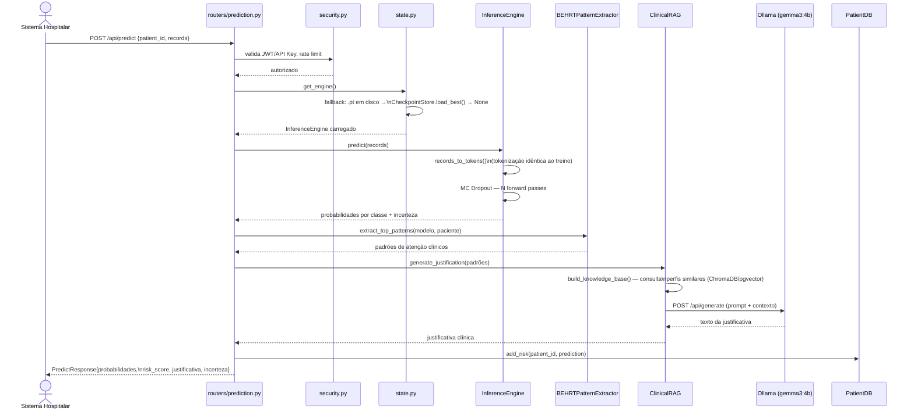

---

## 7. Diagrama de Caso de Uso (UML)

**Nota de renderização:** este é o único diagrama do documento em **PlantUML**, não Mermaid — Mermaid não tem tipo de diagrama de caso de uso. Para visualizar: cole o bloco abaixo em [plantuml.com/plantuml](https://www.plantuml.com/plantuml/uml/) (servidor público), use a extensão "PlantUML" do VS Code, ou rode localmente com `plantuml diagrama.puml` (requer Java + Graphviz).

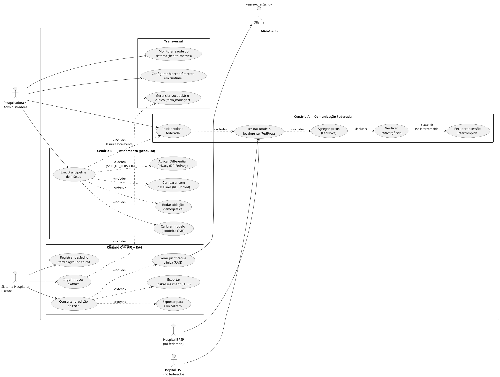

---

## Referência cruzada de nomes — diagrama ↔ código

Para evitar ambiguidade entre o nome usado nos diagramas e o caminho real no repositório (pós-modularização de 2026-07-01):

| Nome no diagrama | Caminho no repositório |
|---|---|
| ServerApp | `infrastructure/mosaicfl_server/` |
| SuperNode | `infrastructure/mosaicfl_client/` |
| Scheduler | `infrastructure/mosaicfl_scheduler/` |
| API de Inferência | `infrastructure/mosaicfl_api/` |
| Ambiente de Pesquisa | `experiments/` (`training_runner/` + `training/core/`) |
| `ProductionFedProxStrategy` | `infrastructure/mosaicfl_server/strategy/` (pacote, mixins) |
| `FedProxClient` | `src/mosaicfl/core/client.py` |
| `FederatedTraining` | `experiments/training/core/orchestrator.py` |
| `InferenceEngine` | `infrastructure/mosaicfl_api/inference_engine/` (pacote) |
| `ClinicalRAG` | `src/mosaicfl/core/rag/` (pacote) |
| `PatientDB` | `infrastructure/mosaicfl_api/db/` (pacote, mixins) |
| `CheckpointStore` | `infrastructure/shared/checkpoint_store/` (pacote) |
| `MetricsStore` | `infrastructure/shared/metrics_store/` (pacote) |

Este documento reflete a estrutura pós-modularização (ver `docs/Linha_do_Tempo_MOSAIC-FL.md`, Parte 10). Se novos módulos forem criados ou renomeados, atualizar esta tabela primeiro — os diagramas C4 nível 3/4 dependem diretamente dela.
