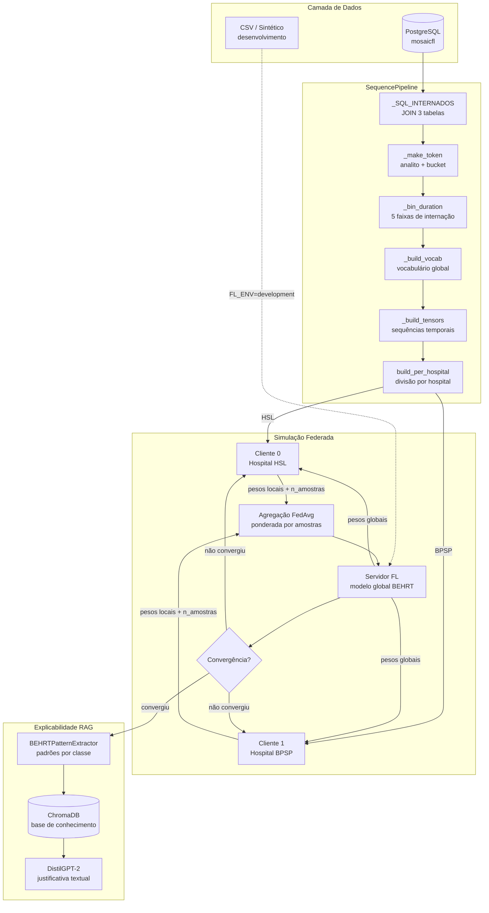
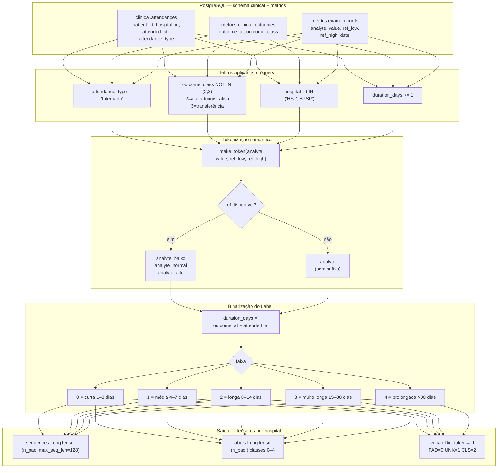
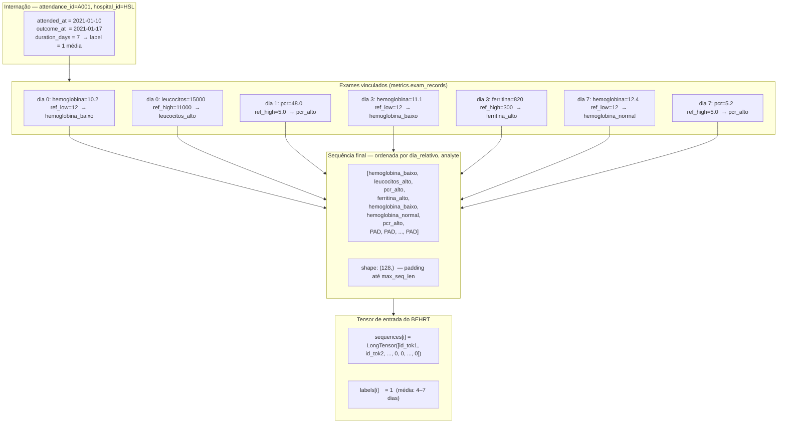
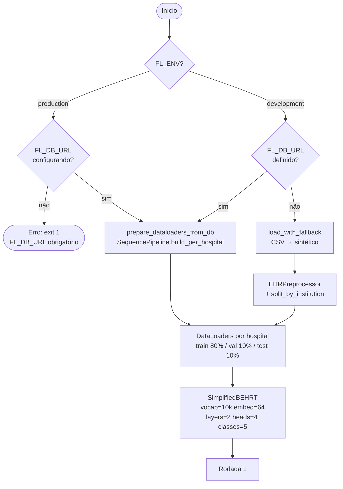
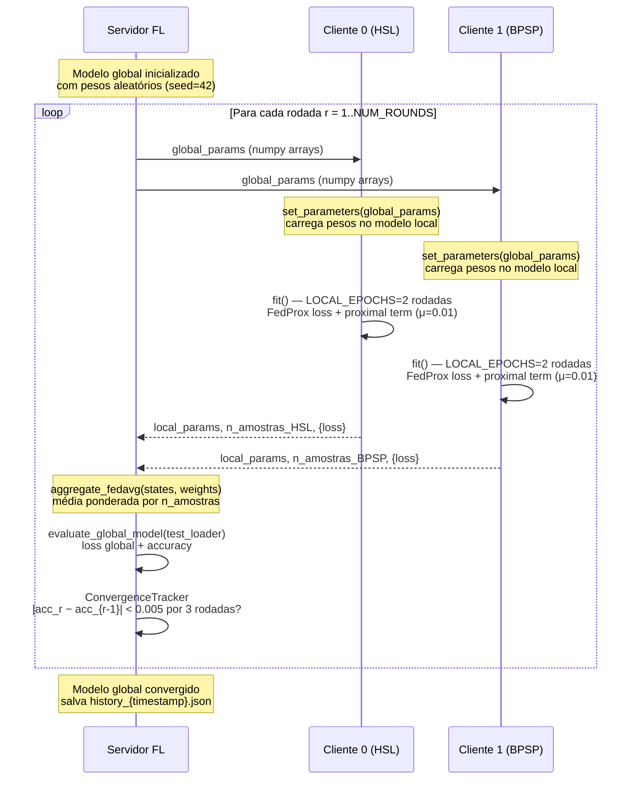
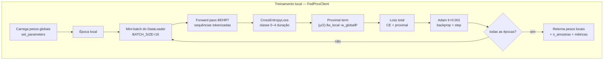
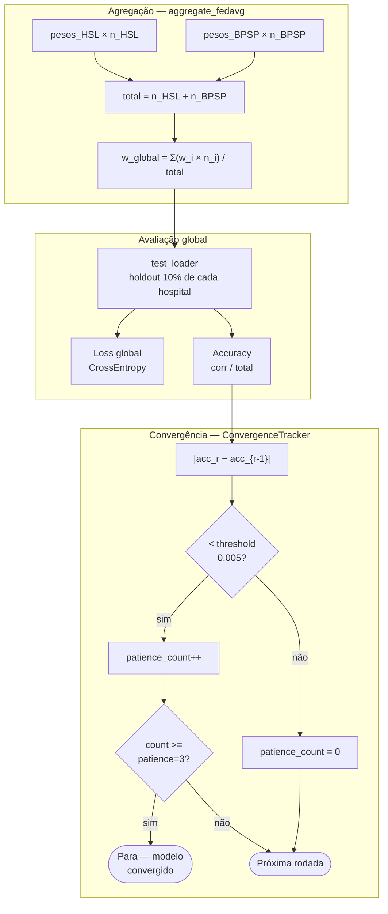
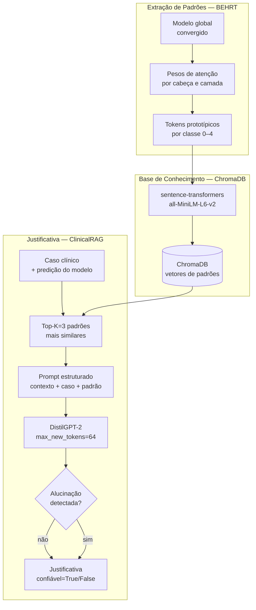
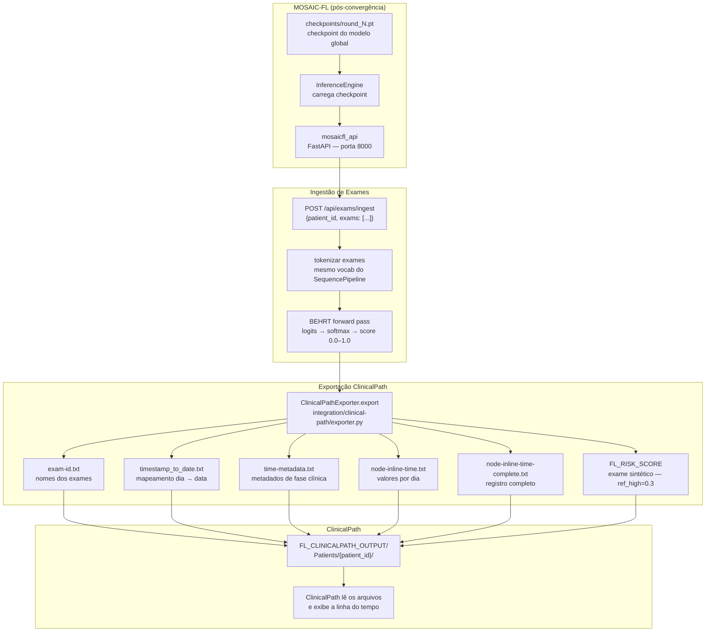

# MOSAIC-FL — Fluxo do Aprendizado Federado com BEHRT e RAG

> Documento técnico descrevendo o fluxo de ponta a ponta do MOSAIC-FL:
> carregamento de dados clínicos hospitalares, tokenização temporal de exames
> laboratoriais, treinamento federado com FedProx (servidor ↔ clientes HSL/BPSP),
> agregação FedAvg e geração de justificativa diagnóstica via RAG.

---

## Índice

1. [Visão Geral](#1-visão-geral)
2. [Pipeline de Dados](#2-pipeline-de-dados)
   - 2.1 [Por que apenas 2 hospitais?](#21-por-que-apenas-2-hospitais-participam-do-fl)
   - 2.2 [Série Temporal Clínica](#22-série-temporal-clínica--construção-da-sequência-behrt)
3. [Inicialização do Servidor FL](#3-inicialização-do-servidor-fl)
4. [Rodada Federada — Comunicação Servidor ↔ Clientes](#4-rodada-federada--comunicação-servidor--clientes)
5. [Treinamento Local com FedProx](#5-treinamento-local-com-fedprox)
6. [Agregação FedAvg e Verificação de Convergência](#6-agregação-fedavg-e-verificação-de-convergência)
7. [Pipeline RAG — Explicabilidade](#7-pipeline-rag--explicabilidade)
8. [Passo a Passo Textual Completo](#8-passo-a-passo-textual-completo)
9. [Variáveis de Ambiente](#9-variáveis-de-ambiente)
10. [Integração com ClinicalPath](#10-integração-com-clinicalpath)

---

## 1. Visão Geral



---

## 2. Pipeline de Dados

O `SequencePipeline` converte registros brutos do PostgreSQL em tensores prontos para o BEHRT.



**Âncora temporal:** cada exame recebe `dia_relativo = exam_date − attended_at` (dias desde a admissão). A sequência é ordenada por `(dia_relativo, analyte)`, capturando a trajetória de estabilização — ou agravamento — dos marcadores laboratoriais ao longo da internação.

---

## 2.1 Por que apenas 2 hospitais participam do FL?

A base FAPESP COVID-19 tem 5 hospitais: **HSL, BPSP, HEI, HFL e HCSP**.
O `SequencePipeline` exige o JOIN de três tabelas ligadas por `attendance_id`.
Apenas HSL e BPSP satisfazem essa condição:

| Hospital | Internados | Tem `attendance_id` nos exames? | Usável no FL? |
|---|---|---|---|
| HSL  | sim | sim — 100% vinculados | **sim** |
| BPSP | sim | sim — 100% vinculados | **sim** |
| HEI  | sim | não — `attendance_id` truncado na ingestão (overflow) | não |
| HFL  | sim | não — exames só têm `patient_id`, sem `attendance_id` | não |
| HCSP | sim | não — exames só têm `patient_id`, sem `attendance_id` | não |

O filtro `AND a.hospital_id IN ('HSL', 'BPSP')` em `_SQL_INTERNADOS` existe para
evitar carregar dados que produziriam sequências vazias, não por limitação arquitetural.

**A arquitetura é dinâmica:** `build_per_hospital()` descobre os hospitais presentes
via `df["hospital_id"].unique()` — se um novo hospital for integrado com `attendance_id`
corretamente vinculado, ele será automaticamente detectado e incluído como cliente FL,
sem mudança de código. Basta remover ou ampliar o filtro na constante `_SQL_INTERNADOS`.

---

## 2.2 Série Temporal Clínica — Construção da Sequência BEHRT

O BEHRT é um modelo de linguagem médica adaptado para sequências de eventos clínicos.
Para alimentá-lo corretamente, cada internação é convertida em uma **linha do tempo de tokens**, onde a posição na sequência reflete a ordem cronológica dos exames em relação à admissão.

### Como a âncora temporal funciona

```
Admissão (attended_at)
│
├── dia_relativo = 0  → exames coletados no dia da entrada
├── dia_relativo = 1  → exames do dia seguinte
├── dia_relativo = 3  → exames do 3º dia
├── dia_relativo = 7  → exames da 1ª semana
│   ...
└── outcome_at        → data de saída → duration_days = label
```

`dia_relativo = GREATEST(0, exam_date − attended_at)` — nunca negativo (exames
pré-admissão são ancorados em zero).

### Diagrama de construção da sequência



### Por que a ordem cronológica importa para o BEHRT

O BEHRT usa **atenção multi-cabeça** (self-attention). Ao processar a sequência ordenada temporalmente, o modelo aprende quais marcadores — e em qual momento da internação — têm maior poder preditivo para a duração:

- **Piora progressiva:** `hemoglobina_baixo → hemoglobina_baixo → hemoglobina_normal`
  sugere recuperação gradual, típica de internações médias.
- **Marcadores inflamatórios persistentes:** `pcr_alto` no dia 0 e ainda `pcr_alto`
  no dia 7 indicam ausência de resolução, correlacionada com internações longas.
- **Posição relativa:** o token `pcr_alto` no dia 1 tem interpretação diferente do
  mesmo token no dia 14 — um sinaliza início de processo infeccioso, o outro
  refratariedade ao tratamento.

A ordenação `(dia_relativo, analyte)` garante que o modelo veja os eventos na
ordem em que ocorreram clinicamente, sem ambiguidade dentro do mesmo dia.

### Padding e truncamento

```
max_seq_len = 128  (tokens)

Se n_tokens > 128 → trunca os tokens mais antigos (mantém os mais recentes)
Se n_tokens < 128 → preenche com PAD (id=0) à direita
```

O token `<CLS>` (id=2) é inserido pelo `SimplifiedBEHRT` no início da sequência
durante o forward pass — não pelo pipeline. O embedding do `<CLS>` é usado como
representação global da internação para a classificação final.

### Distribuição esperada das 5 classes (label)

| Classe | Faixa | Nome | Interpretação clínica |
|---|---|---|---|
| 0 | 1–3 dias | curta | Caso leve, resolução rápida |
| 1 | 4–7 dias | média | Quadro moderado, resposta ao tratamento |
| 2 | 8–14 dias | longa | Complicação ou resposta lenta |
| 3 | 15–30 dias | muito longa | Caso grave, comorbidades |
| 4 | > 30 dias | prolongada | Crítico, UTI prolongada |

> A distribuição entre classes é verificada a cada rodada federada nos logs:
> `dist={0: n0, 1: n1, 2: n2, 3: n3, 4: n4}`

---

## 3. Inicialização do Servidor FL



---

## 4. Rodada Federada — Comunicação Servidor ↔ Clientes



---

## 5. Treinamento Local com FedProx

Em cada rodada, cada cliente executa `LOCAL_EPOCHS = 2` épocas com a função de perda FedProx:

```
Loss_FedProx = Loss_CE(ŷ, y)  +  (μ/2) · ‖w_local − w_global‖²
```

O termo proximal `(μ/2) · ‖w_local − w_global‖²` penaliza desvio excessivo do cliente em relação ao modelo global — essencial para datasets não-IID (heterogeneidade entre HSL e BPSP).



**Por que FedProx e não FedAvg puro?**
FedAvg assume que os dados de cada cliente são i.i.d. (identicamente distribuídos). Na prática, HSL e BPSP têm populações diferentes (perfil etário, mix de patologias, práticas laboratoriais). O termo proximal de FedProx suaviza essa divergência, mantendo cada cliente próximo ao consenso global.

---

## 6. Agregação FedAvg e Verificação de Convergência



---

## 7. Pipeline RAG — Explicabilidade

Após convergência, o `BEHRTPatternExtractor` extrai os tokens mais ativados por classe e constrói uma base de conhecimento vetorial (ChromaDB). O `ClinicalRAG` recupera os padrões mais similares ao caso e o `DistilGPT-2` gera a justificativa em linguagem natural.



---

## 8. Passo a Passo Textual Completo

### Fase 0 — Verificação de Ambiente

1. O sistema lê `FL_ENV` (padrão: `development`).
2. Se `FL_ENV=production` e `FL_DB_URL` não está configurado → **erro imediato**, `sys.exit(1)`.
3. Se `FL_ENV=production` e `allow_synthetic=True` for passado → sintético é silenciosamente bloqueado.

### Fase 1 — Carregamento e Tokenização

4. Se `FL_DB_URL` está definido, `prepare_dataloaders_from_db()` instancia `SequencePipeline`.
5. `SequencePipeline._load_dataframe()` abre conexão com PostgreSQL, testa com `SELECT 1`, executa `_SQL_INTERNADOS` (JOIN de `clinical.attendances`, `metrics.clinical_outcomes`, `metrics.exam_records`).
6. Para cada linha do resultado, `_make_token()` gera o token semântico: `{analyte}_{baixo|normal|alto}` se houver referência, ou apenas `{analyte}`.
7. `_build_vocab()` conta frequência de todos os tokens e mantém os `vocab_size − 3 = 9.997` mais frequentes. Tokens especiais: `PAD=0, UNK=1, CLS=2`.
8. `_build_tensors()` agrupa por `(patient_id, attendance_id)`, ordena exames por `(dia_relativo, analyte)`, converte tokens em IDs, aplica padding/truncamento para `max_seq_len=128`. `_bin_duration()` classifica a duração em 5 classes.
9. `build_per_hospital()` executa os passos 5–8 **uma única vez** e divide os tensores por `hospital_id`: HSL → cliente 0, BPSP → cliente 1.
10. `prepare_dataloaders_from_db()` embaralha cada hospital, divide 80% treino / 10% validação / 10% holdout global, e cria `DataLoader`s com `batch_size=16`.

### Fase 2 — Inicialização do Servidor

11. `SimplifiedBEHRT` é instanciado com `vocab_size=10.000`, `embed_dim=64`, `max_seq_len=128`, `num_layers=2`, `num_heads=4`, `num_classes=5`, `dropout=0.1`. Seed `42` garante reprodutibilidade.
12. O estado do modelo global (`state_dict`) é extraído como lista de arrays NumPy — formato de comunicação com os clientes.

### Fase 3 — Rodada Federada (repetida até NUM_ROUNDS=20 ou convergência)

13. **Distribuição:** o servidor envia `global_params` (lista de arrays) para cada cliente via `client.set_parameters()`.
14. **Treino local:** cada `FedProxClient` carrega os parâmetros globais no modelo local e executa `LOCAL_EPOCHS=2` épocas com `Adam (lr=0.001)`. A loss é `CrossEntropy + (μ/2)·‖w_local − w_global‖²`, com `μ=0.01` (proximal_mu).
15. **Retorno:** cada cliente retorna seus pesos locais (`fit_params`), o número de amostras treinadas (`num_samples`) e a loss local.
16. **Agregação:** `aggregate_fedavg()` calcula a média ponderada dos pesos: `w_global = Σ(w_i · n_i) / Σ(n_i)`. Hospital com mais internados tem maior peso na agregação.
17. **Avaliação:** o servidor avalia o modelo global no `test_loader` (holdout): calcula loss e accuracy.
18. **Convergência:** se `|accuracy_r − accuracy_{r−1}| < 0.005` por `3 rodadas consecutivas`, o loop para. Caso contrário, incrementa o número da rodada e volta ao passo 13.

### Fase 4 — RAG e Explicabilidade

19. `BEHRTPatternExtractor` realiza forward pass no `test_loader` com o modelo final, extrai pesos de atenção por cabeça/camada e identifica os tokens mais ativados para cada uma das 5 classes de duração.
20. Os perfis prototípicos são vetorizados pelo `sentence-transformers/all-MiniLM-L6-v2` e armazenados no ChromaDB.
21. Para um caso de teste, `ClinicalRAG.explain()` recupera os `top_k=3` padrões mais similares, monta um prompt estruturado e o `DistilGPT-2` gera a justificativa (máx. `64` tokens).
22. O sistema verifica alucinação (tokens de alta incerteza ou ausência de evidência clínica no contexto) e sinaliza `confiavel=True/False`.
23. O resultado é salvo em `experiments/data/rag_{timestamp}.json`.

### Fase 5 — Persistência

24. Histórico de rodadas (loss, accuracy, tráfego de comunicação por rodada) é salvo em `experiments/data/history_{timestamp}.json`.
25. O modelo global final pode ser exportado via `torch.save(global_model.state_dict(), ...)` para uso em inferência.

---

## 9. Variáveis de Ambiente

| Variável | Padrão | Descrição |
|---|---|---|
| `FL_ENV` | `development` | `production` bloqueia sintético e exige `FL_DB_URL` |
| `FL_DB_URL` | _(vazio)_ | Connection string PostgreSQL. Obrigatório em produção |
| `FL_DEVICE` | `cpu` | `cpu` ou `cuda` — Dell i7-1165G7 sem GPU dedicada |
| `FL_USE_RAY` | `false` | `true` ativa simulação paralela via Ray |
| `FL_DATA_PATH` | `data/fapesp_covid19` | Diretório para CSVs (modo desenvolvimento) |
| `FL_CHROMA_PATH` | `chroma_db` | Diretório do banco vetorial ChromaDB |
| `FL_EMBEDDING_MODEL` | `sentence-transformers/all-MiniLM-L6-v2` | Modelo de embedding para RAG |
| `FL_LLM_MODEL` | `distilgpt2` | LLM para geração da justificativa RAG |
| `FL_CLINICALPATH_OUTPUT` | `data/clinicalpath_output` | Diretório raiz onde o exportador grava os arquivos ClinicalPath por paciente |

---

## 10. Integração com ClinicalPath

Esta seção descreve como o MOSAIC-FL disponibiliza as predições para o sistema
**ClinicalPath** após o treinamento federado. Não há novo componente aqui —
tudo o que está descrito já está implementado em `infrastructure/mosaicfl_api/`
e `integration/clinical-path/`.

### 10.1 Fluxo Geral



### 10.2 Passo a Passo

**Pré-condição:** o servidor FL convergiu e salvou `checkpoints/round_N.pt`.
O `InferenceEngine` já carregou esse checkpoint ao iniciar a `mosaicfl_api`.

1. **Chamada de ingestão** — O ClinicalPath (ou o sistema do hospital) envia uma
   requisição HTTP para a API do MOSAIC-FL:
   ```
   POST http://mosaicfl-api:8000/api/exams/ingest
   Content-Type: application/json

   {
     "patient_id": "PAC-001",
     "exams": [
       {"analyte": "hemoglobina", "value": 10.2, "ref_low": 12.0, "ref_high": 16.0, "date": "2026-01-03"},
       {"analyte": "leucocitos",  "value": 14800, "ref_low": 4000, "ref_high": 11000, "date": "2026-01-03"}
     ]
   }
   ```

2. **Tokenização e predição** — O `InferenceEngine.predict()` tokeniza os exames
   usando o mesmo vocabulário do `SequencePipeline` (`analito_baixo`, `analito_alto`,
   `analito_normal`), constrói a sequência temporal, passa pelo BEHRT e retorna
   um **score de risco de 0.0 a 1.0** (probabilidade ponderada das 5 faixas de
   duração de internação).

3. **Exportação dos arquivos** — O `ClinicalPathExporter.export()` grava
   **5 arquivos plain-text** no diretório configurado por `FL_CLINICALPATH_OUTPUT`:

   ```
   FL_CLINICALPATH_OUTPUT/
   └── Patients/
       └── PAC-001/
           ├── exam-id.txt                  # lista de analitos do paciente
           ├── timestamp_to_date.txt        # dia_relativo → data real
           ├── time-metadata.txt            # fases clínicas (admissão, pico, etc.)
           ├── node-inline-time.txt         # valores de cada exame por dia
           └── node-inline-time-complete.txt  # registro completo com referências
   ```

4. **Exame sintético `FL_RISK_SCORE`** — Junto com os exames reais, o exportador
   adiciona uma linha especial:
   - **Nome:** `FL_RISK_SCORE`
   - **Valor:** score de risco calculado pelo BEHRT (ex: `0.42`)
   - **Referência:** `ref_high=0.3`

   Isso significa que o ClinicalPath exibirá os dias em que o score ultrapassa 0.3
   **na cor de alerta** da sua interface — exatamente como faz para qualquer exame
   fora da faixa de referência. O score não aparece como uma nota separada; ele é
   tratado pelo ClinicalPath como mais um exame na linha do tempo do paciente.

5. **Leitura pelo ClinicalPath** — O ClinicalPath aponta seu diretório de entrada
   para `FL_CLINICALPATH_OUTPUT`. Quando abre o paciente `PAC-001`, encontra os
   5 arquivos e os exibe na linha do tempo, incluindo o `FL_RISK_SCORE`.

### 10.3 O que o ClinicalPath vê

```
Linha do tempo — PAC-001
Dia 0 (admissão)  │ hemoglobina_baixo │ leucocitos_alto │ FL_RISK_SCORE=0.18
Dia 1             │ pcr_alto          │                 │ FL_RISK_SCORE=0.31 ← ALERTA
Dia 2             │ ferritina_alto    │ leucocitos_alto │ FL_RISK_SCORE=0.45 ← ALERTA
Dia 3             │                   │                 │ FL_RISK_SCORE=0.52 ← ALERTA
```

Dias com `FL_RISK_SCORE > 0.3` são renderizados pelo ClinicalPath na cor de
valor fora de referência, tornando visualmente evidente a evolução do risco
predito pelo modelo federado.

### 10.4 Onde está implementado

| Componente | Arquivo |
|---|---|
| Endpoint de ingestão | `infrastructure/mosaicfl_api/service.py` → `POST /api/exams/ingest` |
| Motor de inferência | `infrastructure/mosaicfl_api/service.py` → `InferenceEngine` |
| Exportador ClinicalPath | `integration/clinical-path/exporter.py` → `ClinicalPathExporter` |
| Modelos de dados | `integration/clinical-path/exporter.py` → `ExamRecord`, `RiskPrediction`, `PatientExport` |
| Diretório de saída | `FL_CLINICALPATH_OUTPUT` (padrão: `data/clinicalpath_output`) |

---

*Gerado para o TCC: "Inteligência Artificial Colaborativa na Saúde: Aprendizado Federado + RAG"*
*Autora: Jacqueline Abreu — MBA Big Data & Inteligência Artificial, ICMC/USP*
